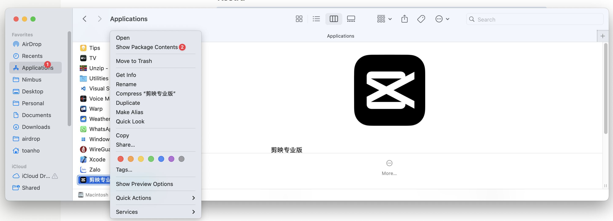
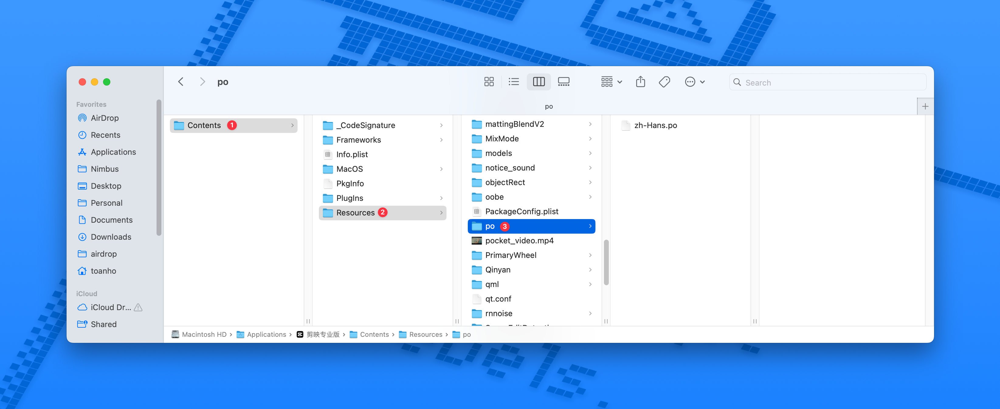
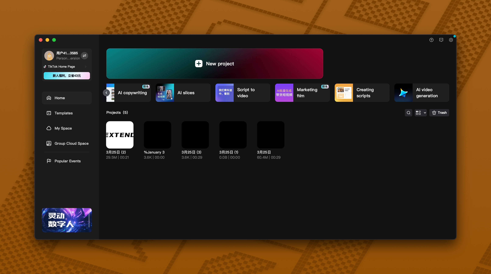

## Capcut Translation

English translation for 剪映 (Jiǎnyìng), also known as Capcut Chinese.

### MacOS Installation Guide

- Step 1: 
- Step 2: 
- Step 3:
  - Create a backup by duplicating `zh-Hans.po` and saving it as `zh-Hans.po.bk`
  - Download the translation file from [https://raw.githubusercontent.com/toanbku/capcut-translation/refs/heads/main/chinese/zh-Hans.po](https://raw.githubusercontent.com/toanbku/capcut-translation/refs/heads/main/chinese/zh-Hans.po) and place it in this directory
- Step 4: Open 剪映 and enjoy the English version
  

### For developer

1. Clone this repository
2. Run `npm install`
3. Run `npm run translate`
